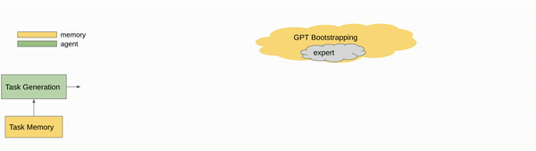
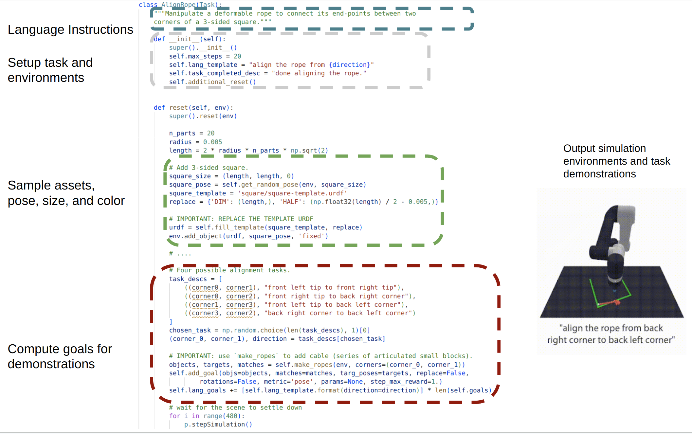
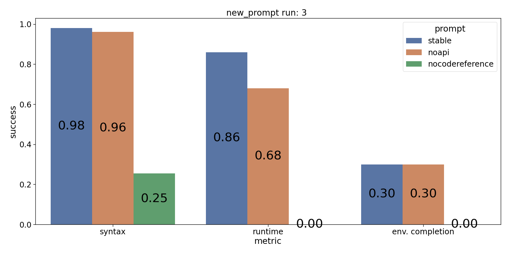
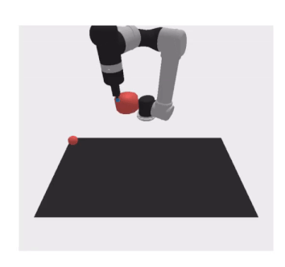
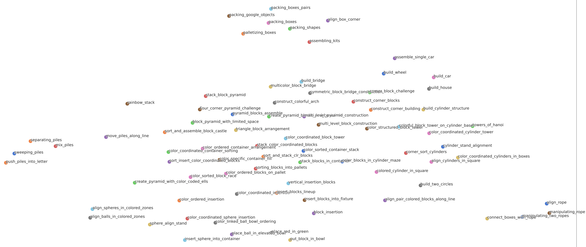

# On An Attempt to Supersize Simulation Task Generation in Robotics with LLM

## Overview
Collecting real-world interaction data to train general robotic policies is prohibitively expensive, thus motivating the use of simulation data. Despite abundant single-task simulation data in terms of object instances and poses among others, the task-level diversity in simulation have remained a challenge. On the other hand, the breakthrough in language domain, such as GPT-4, has shown impressive  coding skills and natural language understanding capability, but its usage in robotics has been mostly on policy execution, planning, and log summary. This repository explores the use of a LLM code generation pipeline to generate simulation environments and expert demonstrations for diverse simulation tasks. In particular, the task-level diversity is crucial for  general-purpose manipulation policy learning. This simulation task generation pipeline can be top-down: given a target task, it proposes a task curriculum to iteratively approach the complexity of the target task; The pipeline can also work in a bottom-up manner: it bootstraps from previous tasks and iteratively proposes more interesting tasks, and these task code can be used to generate demonstrations to train a policy.

We develop an LLM pipeline for generating simulation environments and tasks through program synthesis, as data augmentations for robotic policy learning. The framework consists of three novel components: 
1. an automated prompting mechanism that proposes new tasks and implementations for open-world task design
2. a task library for developing more complex simulation environments and data generations 
3. a GPT-4 generated incremental benchmark and a language-conditioned multi-task policy training method that leverages the large set of generated tasks, and close the loop on evaluating the task generation pipeline. 

Note: Although the field has different opinions on what tasks and skills are, in this work we consider each simulation code defines a task. Therefore the [Ravens](https://github.com/google-research/ravens/tree/master) benchmark has 10 tasks in total.

## Prompt Recipe
Although we can prompt GPT-4 directly to generate simulation environment code for training manipulation policies, it lacks the contexts and the capability required to build an increasing task benchmark. We formulate the task and program synthesis problems into an agent prompting mechanism with a task design agent and a task library (or memory). These sub-components are all powered by few-shot and chain-of-thoughts prompts on large language models that have distilled internet-scale knowledge and offer the reasoning and exploration capability necessary for simulation task generations.

We have developed both top-down and bottom-up task approaches in our method. The top-down approach takes a desired task as a prompt and gradually generates more complex tasks to achieve this target task. This is helpful if the user apriori has a desired task or wants to design a task curriculum to build complex agents. For instance, to train a policy to accomplish long-horizon tasks such as build-house, we can ask LLM to generate more basic tasks like building a base or building a roof. The bottom-up approach shows the LLM the previous tasks that have been designed, directly requests for a new task, and further bootstraps itself iteratively. The goal is then to generate as diverse and interesting tasks as possible for downstream policy training. The details of the prompt is shown in the figure and section below.

## Task Design Prompt
The goal of the task design prompt is to propose novel task descriptions and their code implementations, which can be further broken down into scene code and demonstration code. In particular, we use the [Ravens](https://github.com/google-research/ravens/tree/master) benchmark codebase with TransporterNets that use affordance prediction to solve table-top top-down manipulation tasks. The task design can handle any motion primitive like pushing, sliding, etc. that can be parameterized by two
end-effector poses at each timestep. From the figure, a standard gym-style simulation environment code, the reset function, which is inherited from a base task class and takes in the environment as an argument, efficiently represents the assets and their attributes, poses and their relative configurations, and spatial and language goals that are used to parameterize the per-step demonstration. 

To reach this level of lengthy code generation, we break the prompt of the agent into several steps to enforce its logical structure (e.g. [prompt](prompts/bottomup_task_generation_prompt/)): task description generation, API and common mistake summary, few-shot reference code selection, and code generation. The input prompt to GPT-4 task generation stage consists of several components: 
1. available assets that are in the codebase 
2. samples of reference tasks from the task library (discussed in the next section) to act as few-shot examples 
3. also provide past task names to make sure the agent does not provide overlapped tasks. 
4. some examples of bad tasks and the reasons that they are bad (for example, not physically feasible)
5. some additional rules (such as do not use assets beyond what is available) and the output format. This stage has temperature=1 to encourage diversity and the rest components would have temperature=0 to have some robustness.

The asset generation, which generates the URDFs for loading into a scene, has not been explored much in the pipeline. The API prompt consists of some major function implementations of the base task class as well as an explanation of the `goal` variable that represents the action labels. This is important to help GPT understands some useful helper functions in the base class (such as `get_random_pose` as well as some pybullet (simulation engine) basics. The common error prompt is a list of past errors that GPT-4 has made as well as some high-level errors that are summarized, to help it avoid making repeated errors. These components are optional. 

Finally, reference code selection and code reference prompt will show LLM the generated task names and ask GPT which ones are useful to read, and then show GPT the corresponding code to be used as reference code. This part is critical for LLM to know exactly how to implement a task class in Ravens (such as the logic of sample asset urdfs and build scene first, and then add a spatial goal and language goals).

Prompt Metric Ablation

## Task Library (Memory)
An important differentiator of an agent-based LLM pipeline is that it has a memory of its past actions. In this case, our agent is a simulation task and code programmer and its environment is the physics simulation and human users. The task library has a few roles, for one it provides what past tasks are (in the task generation stage) and past codes are (in the code generation stage) to the task design agent such that it will not try to overlap tasks. It also acts as a benchmark to accumulate all past tasks and bootstrap for more novel tasks. Its saved task codes can be run offline to generate demonstration data. We can also visualize the tasks with an embedding space. The memory also contains a key component: the critic that reflects on the task and code that the agent designed and the reference code, and decides whether the new code will be added to the task memory. The task reflection stage prompt has the following component  
1. the generated task description and code 
2. the current tasks in the library 
3. some examples of accepting and rejecting new task, and then LLM is prompted to answer whether to accept this new task and this improvement will also be in the context window in the next round of the agent task design. 

Note that to improve the robustness of this stage, we prompt GPT three times in parallel to get diverse answers with temperature 0.5, and only accept the task if there is an agreement. We show some selected generated tasks by GPT to explore different reasoning capability of GPT-4.

Stack-Tasks Examples (Complexity)

Build-Task Examples (Creativity)

Pick-and-Place-Task Examples (Compositionality)

<!--   -->

## Policy Training
Once the tasks are generated, we can use these task codes to generate demonstration data and train manipulation policies. We use similar two-stream architectures and transporter architectures as in [CLIPORT](https://cliport.github.io/) to parametrize the policy $\pi$. The model first (i) attends to a local region to decide where to pick, then (ii) computes
a placement location by finding the best match through cross-correlation of deep visual features. The FCNs are extended to two-pathways: semantic and spatial where the semantic stream is conditioned with language features at the bottleneck and fused with intermediate features from the spatial stream. For more details, we refer the reader to the original papers.

<!-- 

Policy Training Results

 -->

## Common Failure Cases
0. The `common_error.txt` in the prompt folder shows some common failure cases of the generation.
1. Since the simulation task code (reset function and class definition) is lengthy compared to simple function completions. It can be prone to bugs such as accessing missing functions or assets which cause compilation errors.
2. When the tasks can be run, it could still have runtime errors such as in dynamics and geometry issues. For instance it can generate a huge object or generate task such as `balance a block on a rope` which is not grounded well.
3. When the task has no runtime issues, the experts (represented by the `goal`) might not complete the task. Or the language descriptions can be too ambiguous to train an agent and require manual filtering.
4. Some tasks are not zero-shot generated: such as `build-house`, `build-car`, and `manipulating-two-ropes` etc. Some tasks are mostly coded by the author for bootstrapping purpose such as `push-piles-into-letter` and `connect-boxes-with-rope`.

Failure Cases

## Related Works
LLM has shown impressive potential to explore the environments and reflect upon its own actions, similar to an agent such as in [Voyager](https://voyager.minedojo.org/). Recent works have explored domain randomizations, [parametric task generations](https://sites.google.com/view/active-task-randomization), and procedural asset generations and text to 3D such as [Shape-E](https://github.com/openai/shap-e) and [Point-E](https://openai.com/research/point-e). Moreover, large language models have been applied to policy learning such as in [PALM-e](https://ai.googleblog.com/2023/03/palm-e-embodied-multimodal-language.html) and [Say-Can](https://say-can.github.io/), task and motion planning such as in [Inner Monologue](https://innermonologue.github.io/), synthesizing policy programs such as in [Code as Policies](https://code-as-policies.github.io/) and [Language as Rewards](https://language-to-reward.github.io/). Past work has also explored LLM's physical grounded capability such as in [Mine's Eye](https://arxiv.org/abs/2210.05359).

## Conclusion and Future Directions
Overall we explored the use of LLM in simulation environment and task generation. It has shown impressive capability to write manipulation tasks along with expert demonstrations and yet still has several drawbacks and thus future directions.
There are a few limitations which could be interesting future directions
1. The asset diversity limits how GPT-4 can generate high diverse and creative tasks. One interesting future direction is to explore asset generation jointly with code generation. 
2. It would be cool to generate thousands of tasks using this pipeline by bootstrapping as well as train an agent that can fit these number of tasks.
3. It would be interesting to carefully study task-level generalization. We have generated an embedding of tasks by use GPT embedding AI to encode the generated code for each task below.

 

## Acknowledgement
I would like to acknowledge [Bailin Wang](https://berlino.github.io/), [Mohit Shridhar](https://mohitshridhar.com/), and [Yoon Kim](https://people.csail.mit.edu/yoonkim/) for the helpful discussions and collaborations.