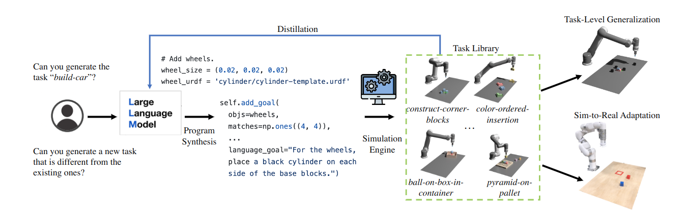

# GenSim: Generating Robotic Simulation Tasks via Large Language Models

### Lirui Wang, Yiyang Ling, Zhecheng Yuan, Mohit Shridhar, Chen Bao, Yuzhe Qin, Bailin Wang, Huazhe Xu, Xiaolong Wang

[Project Page](https://liruiw.github.io/gensim) | [Arxiv](https://arxiv.org/abs/2310.01361) | [Gradio Demo](https://huggingface.co/spaces/Gen-Sim/Gen-Sim) | [Huggingface Dataset](https://huggingface.co/datasets/Gen-Sim/Gen-Sim)

This repo explores the use of an LLM code generation pipeline to write simulation environments and expert goals to augment diverse simulation tasks. 


## ⚙️ Installation
0. ``pip install -r requirements.txt``
1. ``python setup.py develop``
2. ``export GENSIM_ROOT=$(pwd)``
3. ``export OPENAI_KEY=YOUR KEY``. We use OpenAI's GPT-4 as the language model. You need to have an OpenAI API key to run task generation with GenSim. You can get one from [here](https://platform.openai.com/account/api-keys).


## 🚶Getting Started
After the installation process, you can run: 
```
# basic bottom-up prompt
python gensim/run_simulation.py disp=True prompt_folder=vanilla_task_generation_prompt_simple 

# bottom-up template generation
python gensim/run_simulation.py disp=True prompt_folder=bottomup_task_generation_prompt   save_memory=True load_memory=True  task_description_candidate_num=10 use_template=True

# top-down task generation
python gensim/run_simulation.py  disp=True  prompt_folder=topdown_task_generation_prompt save_memory=True load_memory=True task_description_candidate_num=10 use_template=True target_task_name="build-house"

# task-conditioned chain-of-thought generation
python gensim/run_simulation.py  disp=True  prompt_folder=topdown_chain_of_thought_prompt save_memory=True load_memory=True task_description_candidate_num=10 use_template=True target_task_name="build-car"  
```

## 💾 Add and remove task
0. To remove a task (delete its code and remove it from the task and task code buffer), use ``python misc/purge_task.py -f color-sequenced-block-insertion``
1. To add a task (extract task description to add to buffer), use ``python misc/add_task_from_code.py -f ball_on_box_on_container``


## 🤖 LLM Generated Task Usage
1. All generated tasks in `cliport/generated_tasks` should have automatically been imported
2. Set the task name and then use `demo.py` for visualization. For instance, `python cliport/demos.py n=200 task=build-car mode=test disp=True`.
3.  The following is a guide for training everything from scratch (More details in [cliport](https://github.com/cliport/cliport)). All tasks follow a 4-phase workflow:
    1. Generate `train`, `val`, `test` datasets with `demos.py` 
    2. Train agents with `train.py` 
    3. Run validation with `eval.py` to find the best checkpoint on `val` tasks and save `*val-results.json`
    4. Evaluate the best checkpoint in `*val-results.json` on `test` tasks with `eval.py`


## 🎛️ LLM Finetune
1. Prepare data using `python gensim/prepare_finetune_gpt.py`. Released dataset is [here](https://huggingface.co/datasets/Gen-Sim/Gen-Sim)

2. Finetune using openai api ` openai api fine_tunes.create --training_file output/finetune_data_prepared.jsonl --model davinci --suffix 'GenSim'`

3. Evaluate it using `python gensim/evaluate_finetune_model.py  +target_task=build-car +target_model=davinci:ft-mit-cal:gensim-2023-08-06-16-00-56`

4. Compare with `python gensim/run_simulation.py  disp=True  prompt_folder=topdown_task_generation_prompt_simple load_memory=True task_description_candidate_num=10 use_template=True target_task_name="build-house" gpt_model=gpt-3.5-turbo-16k trials=3`

5. Compare with `python gensim/run_simulation.py  disp=True  prompt_folder=topdown_task_generation_prompt_simple_singleprompt load_memory=True task_description_candidate_num=10  target_task_name="build-house" gpt_model=gpt-3.5-turbo-16k` 

6. turbo finetuned models. `python gensim/evaluate_finetune_model.py  +target_task=build-car +target_model=ft:gpt-3.5-turbo-0613:  trials=3 disp=True  `

7. Finetune Code-LLAMA using hugging-face transformer library [here](https://github.com/liruiw/llama-recipes)

8. offline eval: `python -m gensim.evaluate_finetune_model_offline model_output_dir=after_finetune_CodeLlama-13b-Instruct-hf_fewshot_False_epoch_10_0`

## ✅ Note
0. Temperature `0.5-0.8 `is good range for diversity, `0.0-0.2` is for stable results.
1. The generation pipeline will print out statistics regarding compilation, runtime, task design, and diversity scores. Note that these metric depend on the task compexity that LLM tries to generate.
2. Core prompting and code generation scripts are in `gensim` and training and task scripts are in `cliport`.
3. `prompts/` folder stores different kinds of prompts to get the desired environments. Each folder contains a sequence of prompts as well as a meta_data file. `prompts/data` stores the base task library and the generated task library.
4. The GPT-generated tasks are stored in `generated_tasks/`. Use `demo.py` to play with them.  `cliport/demos_gpt4.py` is an  all-in-one prompt script that can be converted into ipython notebook.
5. Raw text outputs are saved in `output/output_stats`, figure results saved in `output/output_figures`, policy evaluation results are saved in `output/cliport_output`.
6. To debug generated code, manually copy-paste ``generated_task.py`` then run 
``python cliport/demos.py n=50 task=gen-task disp=True``
7. This version of cliport should support `batchsize>1` and can run with more recent versions of pytorch and pytorch lightning.
8. Please use Github issue tracker to report bugs. For other questions please contact [Lirui Wang](wangliruisz@gmail.com)
9. blender rendering `python cliport/demos.py n=310 task=align-box-corner mode=test disp=True +record.blender_render=True record.save_video=True`



### Citation
If you find GenSim useful in your research, please consider citing:
```
@inproceedings{wang2023gen,
author    = {Lirui Wang, Yiyang Ling, Zhecheng Yuan, Mohit Shridhar, Chen Bao, Yuzhe Qin, Bailin Wang, Huazhe Xu, Xiaolong Wang},
title     = {GenSim: Generating Robotic Simulation Tasks via Large Language Models},
booktitle = {Arxiv},
year      = {2023}
}
```